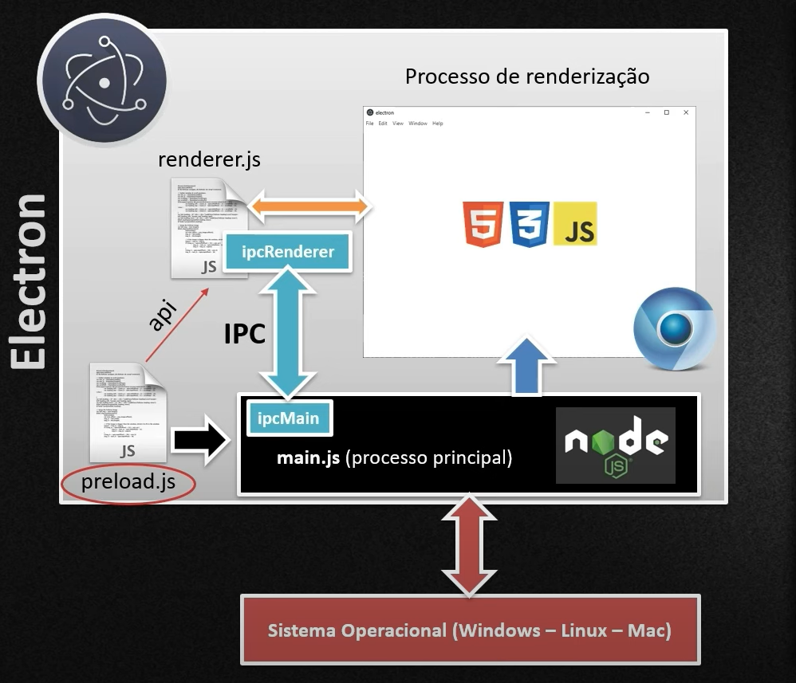

# Electron Tutorial + SQLite + Bootstrap

- [link referência para playlist](https://www.youtube.com/playlist?list=PLbEOwbQR9lqybf2ehSR-KWEv_0g-HDJ50)

🧑‍💻 _Professor José de Assis_

## 📚 Resumo framework
- Utilizado para aplicações Desktop
- Framework cross plataform roda em LINUX, MacOS, Windows
- Conceitos principais: main, renderer, preloader, IPC

## Main
Processo principal onde desempenha o papel semelhante ao backend, se comunica com o SO

## Renderer
Arquivo que se comunica com o frontend da aplicação, páginas HTML

## Preloader
Faz pré carregamento dos arquivos necessários para a comunicação entre front e back (processos), 

## IPC (inter process comunication)
Semelhante a um Websocket, o _IPC renderer_ e o _IPC main_ são responsáveis pela comunicação mediante a channels (canais) onde ambos estão inscritos (subscribe)

## Fluxo de Comunicação

# Considerações ao enpacotar
Para enpacotar e distribuir, por questões de segurança e autenticidade deve-se criar um certificado digital em _ACs (Autoridades Certificadoras)_ em ambientes Windows

# Recursos adicionais SQLite
Caso queira adicionar SQLite arquivo de configuração _database.js_

# Observações 
Projeto para fins de aprendizado conceitual 🚀 não revisado para rodar ao clonar repositório

# Contribuição
🧑‍💻 _Leonardo Peres_